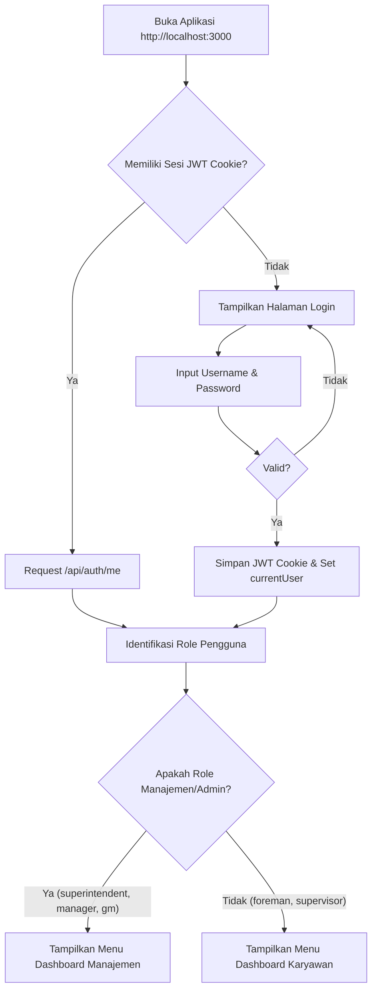
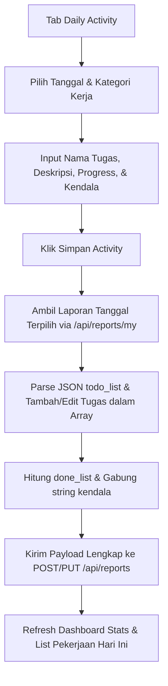
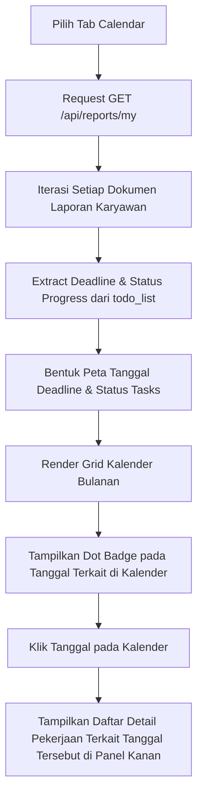
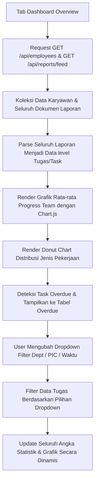
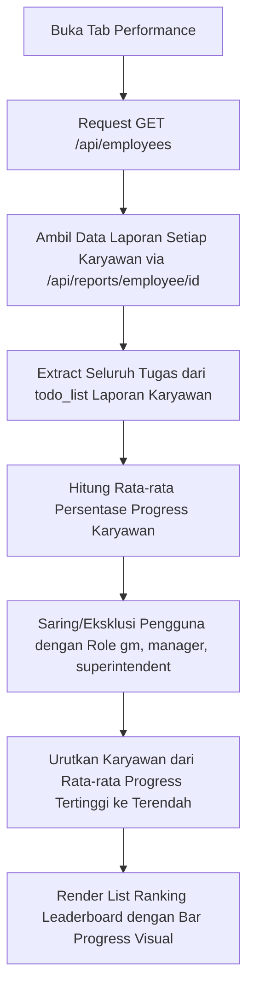
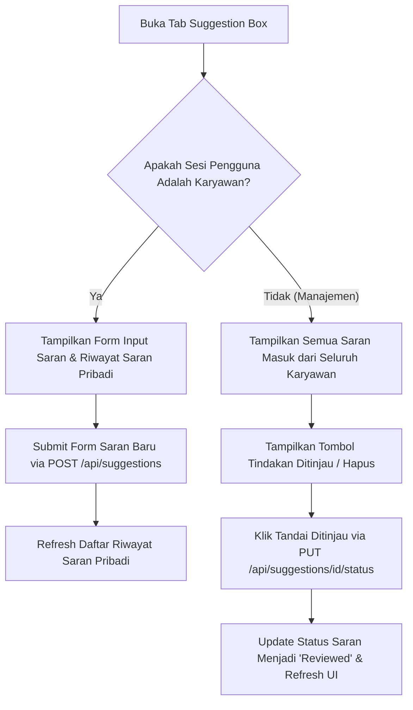

# Cetak Biru (Blueprint) Resmi Proyek: Laporan Aktivitas Harian Karyawan — Versi 4 (Aktual)

Dokumen ini mendefinisikan arsitektur sistem, basis data, diagram alur, dan spesifikasi teknologi untuk **Aplikasi Pelaporan Aktivitas Harian Karyawan** berbasis Single Page Application (SPA) versi 4. Versi ini mencakup penyesuaian zona waktu WITA, pemisahan hak akses peranan (role), fitur leaderboard performance, dan perbaikan visual masukan tanggal (datepicker).

---

## 1. Spesifikasi Teknologi (Tech Stack) & Perkakas

### A. Perkakas Pengembangan (Development Tools)
* **Code Editor:** Antigravity IDE
* **Database Management:** phpMyAdmin (MySQL) via Xampp Control Panel
* **Runtime & Server:** Node.js (v24+) + Express.js
* **Versi Kontrol:** Git & GitHub

### B. Arsitektur & Teknologi Utama
| Komponen | Teknologi | Keterangan |
| :--- | :--- | :--- |
| **Frontend** | HTML5, Vanilla CSS3, Vanilla JavaScript (SPA) | Arsitektur Single Page Application (SPA) dinamis |
| **Backend** | Node.js + Express.js | REST API Server & static file serving |
| **Database** | MySQL | Menggunakan driver `mysql2/promise` untuk koneksi pool asinkron |
| **Keamanan** | JSON Web Token (JWT) & BcryptJS | Enkripsi kata sandi dan manajemen otentikasi sesi via HTTP-only Cookie |
| **Ikon** | Font Awesome 6 | Visualisasi antarmuka pengguna |
| **Font** | Outfit & Plus Jakarta Sans | Diambil via Google Fonts untuk tipografi premium |
| **Grafik** | Chart.js | Visualisasi visual dasbor manajemen |

---

## 2. Struktur Data & Skema Basis Data (MySQL)

Sistem menggunakan database bernama `laporan_aktivitas_karyawan` dengan struktur tiga tabel utama:

```mermaid
erDiagram
    USERS {
        int id PK "AUTO_INCREMENT"
        varchar username UNIQUE "Not Null"
        varchar nama_lengkap "Not Null"
        varchar password "Not Null (Hashed)"
        varchar role "Default 'foreman'"
        timestamp created_at "Default CURRENT_TIMESTAMP"
    }
    DAILY_REPORTS {
        int id PK "AUTO_INCREMENT"
        int user_id FK "References USERS.id (ON DELETE CASCADE)"
        date tanggal "Not Null"
        text todo_list "Not Null (JSON Array)"
        text done_list "Not Null (Plain text summary)"
        text kendala "Nullable"
        timestamp created_at "Default CURRENT_TIMESTAMP"
    }
    SUGGESTIONS {
        int id PK "AUTO_INCREMENT"
        int user_id FK "References USERS.id (ON DELETE CASCADE)"
        varchar title "Not Null"
        varchar category "Not Null"
        text content "Not Null"
        varchar status "Default 'Pending'"
        timestamp created_at "Default CURRENT_TIMESTAMP"
    }
    
    USERS ||--o{ DAILY_REPORTS : "writes"
    USERS ||--o{ SUGGESTIONS : "submits"
```

### A. Detail Kolom Tabel `users`
* `role` didesain untuk menampung peranan manajemen dan pelapor. Role default adalah `'foreman'`. Role disimpan dalam bentuk huruf kecil (`foreman`, `supervisor`, `superintendent`, `manager`, `gm`).

### B. Detail Kolom Tabel `daily_reports`
* `todo_list` adalah kolom teks bertipe `TEXT` yang menyimpan representasi string JSON (JSON array) dari objek pekerjaan. Format objek dalam JSON array tersebut:
  ```json
  [
    {
      "category": "MPE Utama",
      "waktu": "08:30",
      "text": "Design Pit XYZ",
      "description": "Menyusun batas pit limit luar",
      "progress": 70,
      "kendala": "Jaringan lambat",
      "lanjutBesok": false,
      "deadline": "2026-06-25"
    }
  ]
  ```
* `done_list` berisi teks rangkuman berurut untuk tugas dengan `progress = 100` (contoh: `"1. Design Pit XYZ\n"`).

---

## 3. Matriks Hak Akses & Pembagian Navigasi (Role Matrix)

Sistem membedakan pengguna berdasarkan peranan untuk menentukan tab menu yang ditampilkan pada sidebar navigasi:

| Peran (Role) | Kode Menu | Label Menu | Level Akses | Fitur Navigasi Utama |
| :--- | :--- | :--- | :--- | :--- |
| **Foreman** / **Supervisor** | Karyawan | Staff | Penginput Pekerjaan | Dashboard Karyawan, Daily Activity, My Tasks, Open Tasks, Calendar, Reports, Profile, Suggestion Box |
| **Superintendent** / **Manager** / **GM** | Manajemen | Admin/Manager | Penilai & Pemantau | Dashboard Overview, Team Activity, All Tasks, Reports Feed, Performance Leaderboard, Master Data (hanya Superintendent/Admin), Settings, Suggestion Box |

---

## 4. Diagram Alur Sistem (System Flowcharts)

Berikut adalah diagram alur proses utama yang mendeskripsikan logika jalannya aplikasi:

### A. Alur Autentikasi dan Dasbor (SPA Routing)



### B. Alur Input Pekerjaan & Penyimpanan Laporan (Karyawan)



### C. Alur Pengambilan & Tampilan Kalender Deadline (Karyawan)



### D. Alur Dasbor Manajemen & Filter Laporan (Manager Overview)



### E. Alur Perhitungan Leaderboard Kinerja (Leaderboard Performance)



### F. Alur Kotak Saran (Suggestion Box)



---

## 5. API Reference (Backend REST Endpoints)

Semua endpoint di bawah ini diproteksi oleh *Authentication Middleware* (verifikasi JWT via Cookies), kecuali registrasi pertama & login.

### A. Endpoint Autentikasi
* `POST /api/auth/login` : Memvalidasi pengguna dan menetapkan cookie token JWT.
* `POST /api/auth/logout` : Menghapus cookie token JWT.
* `GET /api/auth/me` : Mengambil informasi profil sesi aktif pengguna.

### B. Endpoint Laporan (Karyawan)
* `GET /api/reports/my` : Mengambil seluruh riwayat laporan milik pengguna yang sedang login.
* `POST /api/reports` : Menyimpan laporan harian baru.
* `PUT /api/reports/:id` : Memperbarui laporan harian spesifik (mengirim ulang `todo_list`, `done_list`, dan `kendala`).
* `DELETE /api/reports/:id` : Menghapus satu dokumen laporan harian.

### C. Endpoint Manajemen & Direktur
* `GET /api/reports/feed` : Mengambil laporan harian seluruh pengguna untuk Timeline aktivitas (termasuk role).
* `GET /api/employees` : Mengambil daftar seluruh karyawan yang aktif (mengecualikan GM, Manager, dan Superintendent) beserta jumlah laporan terunggah.
* `GET /api/reports/employee/:id` : Mengambil riwayat laporan dari karyawan tertentu.
* `GET /api/admin/users` : Mengambil seluruh data user terdaftar (Admin/Superintendent Only).
* `POST /api/auth/register` : Mendaftarkan akun baru (Admin/Superintendent Only).
* `DELETE /api/admin/users/:id` : Menghapus akun pengguna secara permanen (Admin/Superintendent Only).

### D. Kotak Saran (Suggestion Box)
* `POST /api/suggestions` : Karyawan mengirim saran.
* `GET /api/suggestions` : Karyawan mengambil sarannya sendiri; Manajemen mengambil seluruh saran masuk.
* `PUT /api/suggestions/:id/status` : Menandai saran telah ditinjau (`Reviewed`) (Manajemen Only).
* `DELETE /api/suggestions/:id` : Menghapus saran (Pemilik saran atau Manajemen).

---

## 6. Fitur Unggulan v4 (Zona Waktu & Kustomisasi UI)

### A. Lokalisasi Zona Waktu WITA (UTC+8)
Seluruh waktu dan operasi tanggal disesuaikan secara default ke Waktu Indonesia Tengah (WITA, `Asia/Makassar`):
1. **Format Timestamp:** Waktu kirim laporan harian diformat ke string WITA menggunakan `Intl.DateTimeFormat` (contoh: `13:48 WITA`).
2. **Date Picker & Checker:** Sistem menggunakan metode format `toLocaleDateString('en-CA', { timeZone: 'Asia/Makassar' })` untuk menghasilkan format string `YYYY-MM-DD` yang presisi, menghindari kesalahan penetapan tanggal akibat pergeseran zona waktu (timezone offset) browser.
3. **Statistik Dasbor Karyawan:** Menghitung jumlah tugas *All-time* (Semua waktu) untuk memberikan statistik kumulatif total tugas yang telah dikerjakan oleh masing-masing staff.

### B. Leaderboard Kinerja Tim (Performance)
* Leaderboard secara dinamis mengurutkan karyawan berdasarkan persentase rata-rata penyelesaian tugas (*Productivity*).
* Menampilkan informasi peranan / jabatan aktual pengguna (**Supervisor** atau **Foreman**).
* Mengeksklusi role manajemen senior (**General Manager**, **Manager**, dan **Superintendent**) karena mereka tidak berwenang menginput data tugas operasional harian.

### C. Kustomisasi Ikon Kalender
* Ikon kalender pemilih tanggal pada halaman *Daily Activity* (untuk input **Tanggal** dan **Deadline**) dipaksa berwarna hitam menggunakan aturan CSS:
  ```css
  #report-date::-webkit-calendar-picker-indicator,
  #task-deadline::-webkit-calendar-picker-indicator {
    filter: brightness(0) !important;
    cursor: pointer;
  }
  ```
  Ini memastikan ikon kalender memiliki kontras visual yang tinggi dan mudah terlihat di atas latar belakang input yang berwarna putih.

---
*Dokumen ini merupakan spesifikasi resmi proyek versi 4. Diperbarui pada 20 Juni 2026.*
